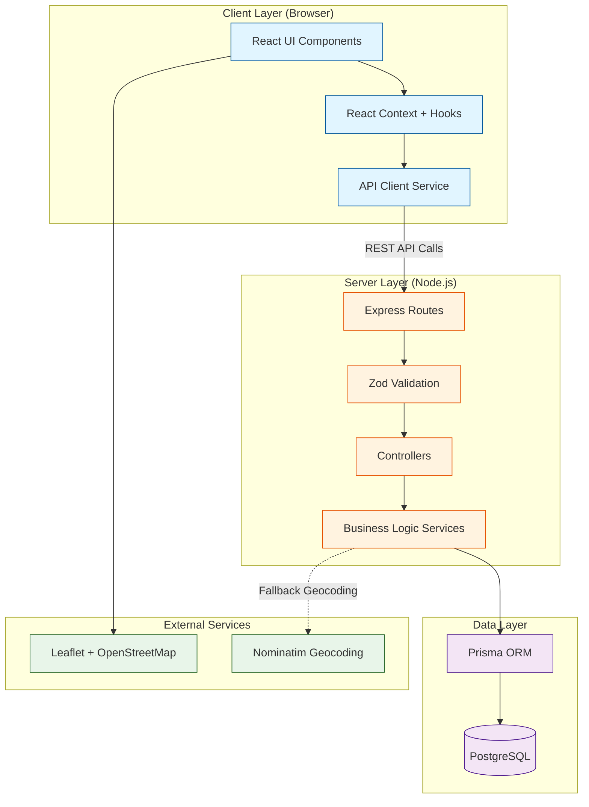

# 1. Introduction and High-Level Architecture

## Executive Summary

The Delivery Manager Application is a web-based system for managing restaurant delivery operations. This architecture document defines the full-stack technical design for building a clean, functional MVP that handles order management, driver coordination, and route visualization.

**Architecture Goals:**
- **Simplicity First**: Straightforward design patterns that are easy to understand and maintain
- **Type Safety**: TypeScript throughout the stack for reliability
- **Developer Experience**: Fast feedback loops with hot reload, clear error messages, and comprehensive testing
- **Future-Ready**: Clean separation of concerns allowing future enhancements without major refactoring

## High-Level Architecture Diagram

## Technology Stack Overview

- **Frontend**: React 18+ with TypeScript, Vite build tool, shadcn/ui component library
- **Backend**: Node.js with Express 4.x and TypeScript
- **Database**: PostgreSQL 14+ accessed via Prisma ORM
- **Deployment**: Vercel (frontend) + Railway (backend + database)
- **Testing**: Vitest, React Testing Library, Jest, Supertest, Playwright

## Architectural Principles

1. **Separation of Concerns**: Clear boundaries between presentation, business logic, and data access
2. **Type Safety**: Shared TypeScript types between frontend and backend
3. **Validation at Boundaries**: Input validation using Zod schemas at API entry points
4. **Stateless Backend**: REST API with no session state (ready for future scaling)
5. **Polling-Based Updates**: Simple 30-second polling for status updates (no WebSockets complexity)
6. **Error Handling**: Standardized error responses with proper HTTP status codes

---
