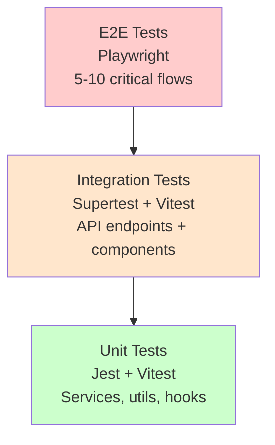

# 13. Testing Strategy

## Testing Pyramid



**Test Distribution:**
- **Unit Tests**: 70% of test coverage
- **Integration Tests**: 20% of test coverage
- **E2E Tests**: 10% of test coverage

## Frontend Testing

### Unit Tests (Vitest + React Testing Library)

**Test Files**: `apps/frontend/tests/unit/*.test.tsx`

**Example: OrderCard Component Test**

```typescript
// apps/frontend/tests/unit/OrderCard.test.tsx
import { render, screen } from '@testing-library/react';
import { OrderCard } from '../../src/components/OrderCard';
import { Order, OrderStatus } from '../../src/types';

describe('OrderCard', () => {
  const mockOrder: Order = {
    id: '123',
    customerName: 'John Doe',
    customerPhone: '555-1234',
    deliveryAddress: '123 Main St, Brooklyn, NY',
    orderDetails: 'Pizza and wings',
    status: OrderStatus.PENDING,
    driverId: null,
    createdAt: new Date(),
    assignedAt: null,
    inTransitAt: null,
    deliveredAt: null,
  };

  it('renders order details correctly', () => {
    render(<OrderCard order={mockOrder} />);

    expect(screen.getByText('John Doe')).toBeInTheDocument();
    expect(screen.getByText('555-1234')).toBeInTheDocument();
    expect(screen.getByText('123 Main St, Brooklyn, NY')).toBeInTheDocument();
    expect(screen.getByText('PENDING')).toBeInTheDocument();
  });

  it('shows assign button for PENDING orders', () => {
    render(<OrderCard order={mockOrder} />);

    expect(screen.getByRole('button', { name: /assign/i })).toBeInTheDocument();
  });
});
```

**Run Tests:**
```bash
npm run test --workspace=apps/frontend
```

### Integration Tests (Vitest + React Testing Library)

**Test Files**: `apps/frontend/tests/integration/*.test.tsx`

**Example: OrdersPage Integration Test**

```typescript
// apps/frontend/tests/integration/OrdersPage.test.tsx
import { render, screen, waitFor } from '@testing-library/react';
import userEvent from '@testing-library/user-event';
import { OrdersPage } from '../../src/pages/Orders';
import { apiClient } from '../../src/services/api/client';

jest.mock('../../src/services/api/client');

describe('OrdersPage', () => {
  it('fetches and displays orders on mount', async () => {
    const mockOrders = [
      { id: '1', customerName: 'Alice', status: 'PENDING' },
      { id: '2', customerName: 'Bob', status: 'DELIVERED' },
    ];

    (apiClient.getOrders as jest.Mock).mockResolvedValue({ orders: mockOrders });

    render(<OrdersPage />);

    await waitFor(() => {
      expect(screen.getByText('Alice')).toBeInTheDocument();
      expect(screen.getByText('Bob')).toBeInTheDocument();
    });
  });

  it('creates new order and refreshes list', async () => {
    (apiClient.createOrder as jest.Mock).mockResolvedValue({ order: { id: '3', customerName: 'Charlie' } });

    render(<OrdersPage />);

    const nameInput = screen.getByLabelText(/customer name/i);
    await userEvent.type(nameInput, 'Charlie');

    const submitButton = screen.getByRole('button', { name: /submit/i });
    await userEvent.click(submitButton);

    await waitFor(() => {
      expect(apiClient.createOrder).toHaveBeenCalled();
    });
  });
});
```

## Backend Testing

### Unit Tests (Jest)

**Test Files**: `apps/backend/tests/unit/*.test.ts`

**Example: OrderService Unit Test**

```typescript
// apps/backend/tests/unit/order.service.test.ts
import { orderService } from '../../src/services/order.service';
import prisma from '../../src/db/client';
import { OrderStatus } from '@prisma/client';

jest.mock('../../src/db/client', () => ({
  __esModule: true,
  default: {
    order: {
      create: jest.fn(),
      findMany: jest.fn(),
      findUnique: jest.fn(),
      update: jest.fn(),
    },
    driver: {
      findUnique: jest.fn(),
    },
  },
}));

describe('OrderService', () => {
  afterEach(() => {
    jest.clearAllMocks();
  });

  describe('create', () => {
    it('creates order with geocoded coordinates', async () => {
      const mockOrder = {
        id: '123',
        customerName: 'John',
        customerPhone: '555-1234',
        deliveryAddress: '123 Main St',
        orderDetails: 'Pizza',
        status: OrderStatus.PENDING,
        latitude: 40.7128,
        longitude: -74.006,
      };

      (prisma.order.create as jest.Mock).mockResolvedValue(mockOrder);

      const result = await orderService.create({
        customerName: 'John',
        customerPhone: '555-1234',
        deliveryAddress: '123 Main St',
        orderDetails: 'Pizza',
      });

      expect(result).toEqual(mockOrder);
      expect(prisma.order.create).toHaveBeenCalled();
    });
  });

  describe('assignToDriver', () => {
    it('throws error if driver is unavailable', async () => {
      (prisma.driver.findUnique as jest.Mock).mockResolvedValue({
        id: 'driver-1',
        isAvailable: false,
      });

      await expect(
        orderService.assignToDriver('order-1', 'driver-1')
      ).rejects.toThrow('Driver is not available');
    });
  });
});
```

**Run Tests:**
```bash
npm run test --workspace=apps/backend
```

### Integration Tests (Supertest)

**Test Files**: `apps/backend/tests/integration/*.test.ts`

**Example: Orders API Integration Test**

```typescript
// apps/backend/tests/integration/orders.api.test.ts
import request from 'supertest';
import app from '../../src/server';
import prisma from '../../src/db/client';

describe('Orders API', () => {
  beforeEach(async () => {
    await prisma.order.deleteMany();
  });

  afterAll(async () => {
    await prisma.$disconnect();
  });

  describe('POST /api/orders', () => {
    it('creates new order with valid data', async () => {
      const orderData = {
        customerName: 'Jane Doe',
        customerPhone: '555-5678',
        deliveryAddress: '456 Elm St, Brooklyn, NY',
        orderDetails: 'Burger and fries',
      };

      const response = await request(app)
        .post('/api/orders')
        .send(orderData)
        .expect(201);

      expect(response.body.order).toMatchObject({
        customerName: 'Jane Doe',
        status: 'PENDING',
      });
      expect(response.body.order.id).toBeDefined();
    });

    it('returns 400 for invalid data', async () => {
      const invalidData = {
        customerName: '',
        customerPhone: 'invalid',
      };

      await request(app)
        .post('/api/orders')
        .send(invalidData)
        .expect(400);
    });
  });

  describe('PATCH /api/orders/:id/assign', () => {
    it('assigns order to available driver', async () => {
      const driver = await prisma.driver.create({
        data: { name: 'Driver 1', isAvailable: true },
      });

      const order = await prisma.order.create({
        data: {
          customerName: 'Test',
          customerPhone: '555-0000',
          deliveryAddress: 'Test St',
          orderDetails: 'Test order',
          status: 'PENDING',
        },
      });

      const response = await request(app)
        .patch(`/api/orders/${order.id}/assign`)
        .send({ driverId: driver.id })
        .expect(200);

      expect(response.body.order.driverId).toBe(driver.id);
      expect(response.body.order.status).toBe('ASSIGNED');
    });
  });
});
```

## End-to-End Tests (Playwright)

**Test Files**: `tests/e2e/*.spec.ts`

**Example: Order Creation Flow**

```typescript
// tests/e2e/orders.spec.ts
import { test, expect } from '@playwright/test';

test.describe('Order Management', () => {
  test('complete order creation and assignment flow', async ({ page }) => {
    // Navigate to orders page
    await page.goto('http://localhost:5173/orders');

    // Fill in order form
    await page.fill('input[name="customerName"]', 'E2E Test Customer');
    await page.fill('input[name="customerPhone"]', '555-9999');
    await page.fill('input[name="deliveryAddress"]', '789 Test Ave, Brooklyn, NY');
    await page.fill('textarea[name="orderDetails"]', 'Test order details');

    // Submit form
    await page.click('button[type="submit"]');

    // Verify order appears in list
    await expect(page.locator('text=E2E Test Customer')).toBeVisible();
    await expect(page.locator('text=PENDING')).toBeVisible();

    // Assign to driver
    await page.selectOption('select[name="driverId"]', { index: 1 });
    await page.click('button:has-text("Assign")');

    // Verify status changed
    await expect(page.locator('text=ASSIGNED')).toBeVisible();
  });
});
```

**Run E2E Tests:**
```bash
npm run test:e2e
```

## Test Coverage Goals

- **Overall Coverage**: 70%+ lines covered
- **Critical Paths**: 100% coverage for core business logic (order assignment, status transitions)
- **API Endpoints**: 100% coverage for all REST endpoints
- **Components**: 80%+ coverage for UI components

**Generate Coverage Report:**
```bash
# Frontend
npm run test -- --coverage --workspace=apps/frontend

# Backend
npm run test -- --coverage --workspace=apps/backend
```

## Continuous Testing

- **Pre-commit Hook**: Run linting and format check
- **CI Pipeline**: Run all tests on every PR
- **Coverage Enforcement**: Fail CI if coverage drops below 70%

---
