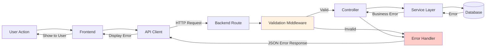

# 15. Error Handling Strategy

## Error Handling Flow



## Error Response Format

All errors follow a consistent JSON structure:

```typescript
interface ErrorResponse {
  error: {
    code: string;           // Machine-readable error code
    message: string;        // Human-readable message
    details?: any;          // Optional additional context (e.g., validation errors)
  };
}
```

**Example Error Responses:**

```json
// Validation Error
{
  "error": {
    "code": "VALIDATION_ERROR",
    "message": "Request validation failed",
    "details": {
      "issues": [
        {
          "path": ["body", "customerName"],
          "message": "String must contain at least 1 character(s)"
        }
      ]
    }
  }
}

// Not Found Error
{
  "error": {
    "code": "NOT_FOUND",
    "message": "Order not found"
  }
}

// Business Logic Error
{
  "error": {
    "code": "DRIVER_UNAVAILABLE",
    "message": "Driver is not available for assignment"
  }
}
```

## Frontend Error Handling

### API Client Error Handling

**Custom ApiError Class** (`apps/frontend/src/services/api/client.ts`):

```typescript
export class ApiError extends Error {
  constructor(
    message: string,
    public statusCode: number,
    public code?: string,
    public details?: any
  ) {
    super(message);
    this.name = 'ApiError';
  }

  isValidationError() {
    return this.code === 'VALIDATION_ERROR';
  }

  isNotFoundError() {
    return this.statusCode === 404;
  }
}
```

**Error Handling in API Client:**

```typescript
async request<T>(endpoint: string, options?: RequestInit): Promise<T> {
  try {
    const response = await fetch(`${this.baseUrl}${endpoint}`, options);

    if (!response.ok) {
      const errorData = await response.json();
      throw new ApiError(
        errorData.error?.message || 'Request failed',
        response.status,
        errorData.error?.code,
        errorData.error?.details
      );
    }

    return response.json();
  } catch (error) {
    if (error instanceof ApiError) {
      throw error;
    }
    // Network errors or other issues
    throw new ApiError('Network error occurred', 0);
  }
}
```

### Component-Level Error Handling

**Display Errors to User:**

```typescript
export function OrderForm() {
  const [error, setError] = useState<string | null>(null);
  const [fieldErrors, setFieldErrors] = useState<Record<string, string>>({});

  const handleSubmit = async (data: CreateOrderRequest) => {
    try {
      setError(null);
      setFieldErrors({});
      await apiClient.createOrder(data);
      // Success handling...
    } catch (err) {
      if (err instanceof ApiError) {
        if (err.isValidationError() && err.details?.issues) {
          // Map Zod errors to form fields
          const errors: Record<string, string> = {};
          err.details.issues.forEach((issue: any) => {
            const field = issue.path[issue.path.length - 1];
            errors[field] = issue.message;
          });
          setFieldErrors(errors);
        } else {
          setError(err.message);
        }
      } else {
        setError('An unexpected error occurred');
      }
    }
  };

  return (
    <form onSubmit={handleSubmit}>
      {error && <Alert variant="destructive">{error}</Alert>}
      <Input name="customerName" error={fieldErrors.customerName} />
      {/* ... */}
    </form>
  );
}
```

### Global Error Boundary

**React Error Boundary Component** (`apps/frontend/src/components/ErrorBoundary.tsx`):

```typescript
import React, { Component, ErrorInfo, ReactNode } from 'react';

interface Props {
  children: ReactNode;
}

interface State {
  hasError: boolean;
  error: Error | null;
}

export class ErrorBoundary extends Component<Props, State> {
  constructor(props: Props) {
    super(props);
    this.state = { hasError: false, error: null };
  }

  static getDerivedStateFromError(error: Error): State {
    return { hasError: true, error };
  }

  componentDidCatch(error: Error, errorInfo: ErrorInfo) {
    console.error('ErrorBoundary caught error:', error, errorInfo);
    // Future: Send to error tracking service (e.g., Sentry)
  }

  render() {
    if (this.state.hasError) {
      return (
        <div className="error-boundary">
          <h1>Something went wrong</h1>
          <p>{this.state.error?.message}</p>
          <button onClick={() => window.location.reload()}>
            Reload Page
          </button>
        </div>
      );
    }

    return this.props.children;
  }
}
```

## Backend Error Handling

### Custom Error Classes

**File**: `apps/backend/src/utils/errors.ts`

```typescript
export class AppError extends Error {
  constructor(
    public code: string,
    message: string,
    public statusCode: number = 500,
    public details?: Record<string, any>
  ) {
    super(message);
    this.name = 'AppError';
    Error.captureStackTrace(this, this.constructor);
  }
}

// Specific error types
export class NotFoundError extends AppError {
  constructor(resource: string) {
    super('NOT_FOUND', `${resource} not found`, 404);
  }
}

export class ValidationError extends AppError {
  constructor(message: string, details?: any) {
    super('VALIDATION_ERROR', message, 400, details);
  }
}

export class BusinessLogicError extends AppError {
  constructor(code: string, message: string) {
    super(code, message, 400);
  }
}
```

### Error Handler Middleware

**File**: `apps/backend/src/middleware/errorHandler.ts`

```typescript
import { Request, Response, NextFunction } from 'express';
import { ZodError } from 'zod';
import { Prisma } from '@prisma/client';
import { AppError } from '../utils/errors';
import logger from '../utils/logger';

export function errorHandler(
  err: Error,
  req: Request,
  res: Response,
  next: NextFunction
) {
  // Log error
  logger.error('Error occurred', {
    error: err.message,
    stack: err.stack,
    url: req.url,
    method: req.method,
  });

  // Zod validation errors
  if (err instanceof ZodError) {
    return res.status(400).json({
      error: {
        code: 'VALIDATION_ERROR',
        message: 'Request validation failed',
        details: { issues: err.errors },
      },
    });
  }

  // Prisma errors
  if (err instanceof Prisma.PrismaClientKnownRequestError) {
    if (err.code === 'P2002') {
      return res.status(409).json({
        error: {
          code: 'CONFLICT',
          message: 'Resource already exists',
          details: { fields: err.meta?.target },
        },
      });
    }
    if (err.code === 'P2025') {
      return res.status(404).json({
        error: {
          code: 'NOT_FOUND',
          message: 'Resource not found',
        },
      });
    }
  }

  // Custom AppError
  if (err instanceof AppError) {
    return res.status(err.statusCode).json({
      error: {
        code: err.code,
        message: err.message,
        details: err.details,
      },
    });
  }

  // Default 500 error
  return res.status(500).json({
    error: {
      code: 'INTERNAL_ERROR',
      message: process.env.NODE_ENV === 'production'
        ? 'An internal error occurred'
        : err.message,
    },
  });
}
```

### Using Errors in Services

```typescript
import { AppError, NotFoundError, BusinessLogicError } from '../utils/errors';

export class OrderService {
  async assignToDriver(orderId: string, driverId: string): Promise<Order> {
    const driver = await prisma.driver.findUnique({ where: { id: driverId } });
    if (!driver) {
      throw new NotFoundError('Driver');
    }

    if (!driver.isAvailable) {
      throw new BusinessLogicError('DRIVER_UNAVAILABLE', 'Driver is not available');
    }

    const order = await prisma.order.findUnique({ where: { id: orderId } });
    if (!order) {
      throw new NotFoundError('Order');
    }

    if (order.status !== OrderStatus.PENDING) {
      throw new BusinessLogicError(
        'INVALID_TRANSITION',
        'Order must be in PENDING status to assign'
      );
    }

    return prisma.order.update({
      where: { id: orderId },
      data: { driverId, status: OrderStatus.ASSIGNED, assignedAt: new Date() },
    });
  }
}
```

## Logging Strategy

**Winston Logger Configuration** (`apps/backend/src/utils/logger.ts`):

```typescript
import winston from 'winston';

const logger = winston.createLogger({
  level: process.env.LOG_LEVEL || 'info',
  format: winston.format.combine(
    winston.format.timestamp({ format: 'YYYY-MM-DD HH:mm:ss' }),
    winston.format.errors({ stack: true }),
    winston.format.json()
  ),
  defaultMeta: { service: 'delivery-manager-backend' },
  transports: [
    new winston.transports.File({ filename: 'logs/error.log', level: 'error' }),
    new winston.transports.File({ filename: 'logs/combined.log' }),
  ],
});

// Console logging for development
if (process.env.NODE_ENV !== 'production') {
  logger.add(new winston.transports.Console({
    format: winston.format.combine(
      winston.format.colorize(),
      winston.format.simple()
    ),
  }));
}

export default logger;
```

**Logging Examples:**

```typescript
// Info logging
logger.info('Order created', { orderId: order.id, customerId: order.customerId });

// Error logging
logger.error('Failed to assign order', {
  orderId,
  driverId,
  error: error.message
});

// Warning logging
logger.warn('Geocoding failed, using null coordinates', {
  address: order.deliveryAddress
});
```

## Error Categories

**4xx Client Errors:**
- `400 Bad Request`: Validation errors, business logic violations
- `404 Not Found`: Resource not found
- `409 Conflict`: Duplicate resource (e.g., unique constraint violation)

**5xx Server Errors:**
- `500 Internal Server Error`: Unexpected errors, database failures, unhandled exceptions

**Custom Error Codes:**
- `VALIDATION_ERROR`: Request body/params failed validation
- `NOT_FOUND`: Resource not found
- `DRIVER_UNAVAILABLE`: Driver not available for assignment
- `INVALID_TRANSITION`: Invalid order status transition
- `INTERNAL_ERROR`: Catch-all for unexpected errors

---
