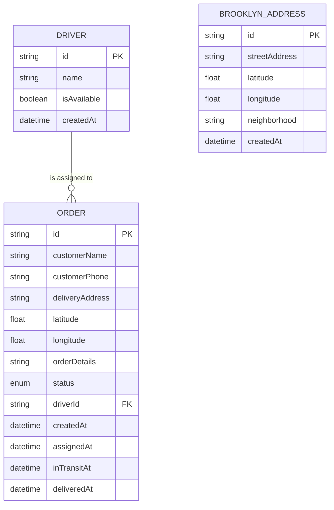

# 3. Data Models

## Core Domain Models

### Order Model

```typescript
interface Order {
  id: string;                    // UUID
  customerName: string;          // Customer full name
  customerPhone: string;         // Contact number
  deliveryAddress: string;       // Full street address
  latitude: number | null;       // Geocoded latitude (nullable)
  longitude: number | null;      // Geocoded longitude (nullable)
  orderDetails: string;          // Simple text field for order contents
  status: OrderStatus;           // Enum: PENDING | ASSIGNED | IN_TRANSIT | DELIVERED
  driverId: string | null;       // Foreign key to Driver (nullable)
  driver?: Driver;               // Relation to Driver model
  createdAt: Date;               // Order creation timestamp
  assignedAt: Date | null;       // When order was assigned to driver
  inTransitAt: Date | null;      // When driver started delivery
  deliveredAt: Date | null;      // When delivery was completed
}

enum OrderStatus {
  PENDING = 'PENDING',           // Order created, awaiting assignment
  ASSIGNED = 'ASSIGNED',         // Assigned to driver, not yet started
  IN_TRANSIT = 'IN_TRANSIT',     // Driver is delivering
  DELIVERED = 'DELIVERED'        // Delivery completed
}
```

### Driver Model

```typescript
interface Driver {
  id: string;                    // UUID
  name: string;                  // Driver full name
  isAvailable: boolean;          // Availability status (true/false)
  createdAt: Date;               // Driver record creation timestamp
  orders: Order[];               // Relation: assigned orders
}
```

### Brooklyn Address Model (Seed Data)

```typescript
interface BrooklynAddress {
  id: string;                    // UUID
  streetAddress: string;         // e.g., "123 Bedford Ave, Brooklyn, NY 11211"
  latitude: number;              // Pre-seeded Brooklyn coordinate
  longitude: number;             // Pre-seeded Brooklyn coordinate
  neighborhood: string;          // e.g., "Williamsburg", "Park Slope"
  createdAt: Date;               // Seed timestamp
}
```

## Model Relationships



## Model Validation Rules

**Order Validation:**
- `customerName`: Required, 1-100 characters
- `customerPhone`: Required, matches phone pattern (e.g., "555-1234" or "(212) 555-1234")
- `deliveryAddress`: Required, 5-200 characters
- `orderDetails`: Required, 1-500 characters
- `status`: Must be valid OrderStatus enum value
- `driverId`: Must reference existing Driver if provided

**Driver Validation:**
- `name`: Required, 1-100 characters
- `isAvailable`: Required, boolean

**Business Rules:**
- Order can only be assigned to available driver (`isAvailable = true`)
- Order status transitions must follow sequence: PENDING → ASSIGNED → IN_TRANSIT → DELIVERED
- Once order is DELIVERED, it cannot transition to other states
- Driver cannot be deleted if they have active orders (ASSIGNED or IN_TRANSIT)

---
