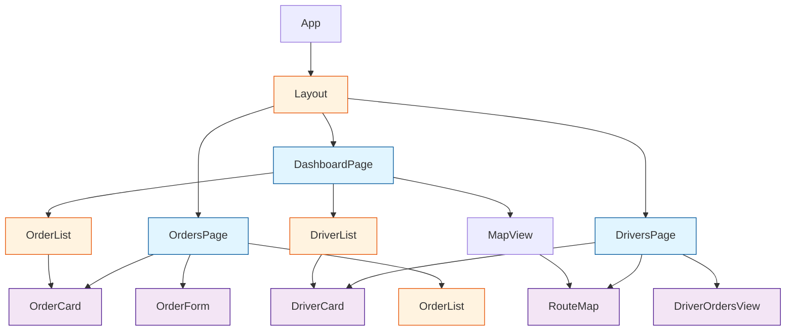

# 5. Frontend Components

## Component Architecture

The frontend follows a hierarchical component structure with clear separation between presentational and container components.

## Core Components

### 1. App Component
- **Path**: `apps/frontend/src/App.tsx`
- **Purpose**: Root component, sets up routing and global providers
- **Responsibilities**:
  - React Router setup
  - Context providers (OrdersContext, DriversContext)
  - Global error boundary
- **State**: None (delegates to context providers)

### 2. Layout Component
- **Path**: `apps/frontend/src/components/Layout.tsx`
- **Purpose**: Common page structure (header, nav, content area)
- **Responsibilities**:
  - Top navigation bar with app title
  - Navigation links (Dashboard, Orders, Drivers)
  - Content outlet for routed pages
- **Uses shadcn/ui**: `NavigationMenu`, `Card`

### 3. DashboardPage
- **Path**: `apps/frontend/src/pages/Dashboard.tsx`
- **Purpose**: Main overview page showing orders, drivers, and map
- **Responsibilities**:
  - Display summary statistics (total orders, pending, in-transit, delivered)
  - Show recent orders list
  - Show available drivers
  - Display map with all active deliveries
- **Data Fetching**: Polls `/api/orders` and `/api/drivers` every 30 seconds
- **Uses Components**: `OrderList`, `DriverList`, `MapView`

### 4. OrdersPage
- **Path**: `apps/frontend/src/pages/Orders.tsx`
- **Purpose**: Order management page
- **Responsibilities**:
  - Display all orders with filtering by status
  - Create new order form
  - Assign orders to drivers
  - Update order status
- **Data Fetching**: Polls `/api/orders` every 30 seconds
- **Uses Components**: `OrderForm`, `OrderList`, `OrderCard`

### 5. DriversPage
- **Path**: `apps/frontend/src/pages/Drivers.tsx`
- **Purpose**: Driver management and route visualization
- **Responsibilities**:
  - Display all drivers with availability status
  - Show assigned orders for each driver
  - Display route map for selected driver
  - Toggle driver availability
- **Data Fetching**: Polls `/api/drivers` and `/api/drivers/:id/route` every 30 seconds
- **Uses Components**: `DriverCard`, `DriverOrdersView`, `RouteMap`

### 6. OrderForm Component
- **Path**: `apps/frontend/src/components/OrderForm.tsx`
- **Purpose**: Form for creating new orders
- **Responsibilities**:
  - Input fields: customerName, customerPhone, deliveryAddress, orderDetails
  - Client-side validation (Zod schema)
  - Submit to POST `/api/orders`
  - Display validation errors
- **Uses shadcn/ui**: `Form`, `Input`, `Textarea`, `Button`

### 7. OrderCard Component
- **Path**: `apps/frontend/src/components/OrderCard.tsx`
- **Purpose**: Display single order with actions
- **Props**: `order: Order`, `onAssign?: (orderId: string, driverId: string) => void`
- **Responsibilities**:
  - Show order details (customer, address, status, timestamps)
  - Display status badge with color coding
  - Assign to driver (dropdown with available drivers)
  - Update status buttons (conditional based on current status)
- **Uses shadcn/ui**: `Card`, `Badge`, `Select`, `Button`

### 8. OrderList Component
- **Path**: `apps/frontend/src/components/OrderList.tsx`
- **Purpose**: List of orders grouped by status
- **Props**: `orders: Order[]`, `groupByStatus?: boolean`
- **Responsibilities**:
  - Render multiple `OrderCard` components
  - Optional grouping by status (Pending, Assigned, In-Transit, Delivered)
  - Handle empty state
- **Uses shadcn/ui**: `Tabs`, `ScrollArea`

### 9. DriverCard Component
- **Path**: `apps/frontend/src/components/DriverCard.tsx`
- **Purpose**: Display single driver with availability toggle
- **Props**: `driver: Driver`, `onToggleAvailability: (driverId: string) => void`
- **Responsibilities**:
  - Show driver name and availability status
  - Display count of assigned orders
  - Toggle availability switch
- **Uses shadcn/ui**: `Card`, `Switch`, `Badge`

### 10. DriverList Component
- **Path**: `apps/frontend/src/components/DriverList.tsx`
- **Purpose**: List all drivers
- **Props**: `drivers: Driver[]`
- **Responsibilities**:
  - Render multiple `DriverCard` components
  - Handle empty state
- **Uses shadcn/ui**: `ScrollArea`

### 11. MapView Component
- **Path**: `apps/frontend/src/components/MapView.tsx`
- **Purpose**: Display map with delivery locations
- **Props**: `orders: Order[]`, `center?: { lat: number; lng: number }`
- **Responsibilities**:
  - Render Leaflet map with OpenStreetMap tiles
  - Plot markers for each order location
  - Color-code markers by order status
  - Show popup on marker click with order details
- **Uses**: `react-leaflet` (`MapContainer`, `TileLayer`, `Marker`, `Popup`)

### 12. RouteMap Component
- **Path**: `apps/frontend/src/components/RouteMap.tsx`
- **Purpose**: Display suggested route for driver's deliveries
- **Props**: `driverId: string`
- **Responsibilities**:
  - Fetch route data from `/api/drivers/:id/route`
  - Render Leaflet map with route polyline
  - Plot numbered markers for delivery sequence
  - Show route waypoints
- **Uses**: `react-leaflet` (`MapContainer`, `TileLayer`, `Marker`, `Polyline`, `Popup`)

## Component Guidelines

- **Reusability**: Components should be generic and reusable where possible
- **Single Responsibility**: Each component has one clear purpose
- **Props over Context**: Prefer explicit props; use context only for global state
- **TypeScript**: All components have typed props interfaces
- **Error Boundaries**: Wrap pages in error boundaries to handle rendering errors
- **Loading States**: Show loading spinners during data fetching
- **Empty States**: Display helpful messages when no data available

---
